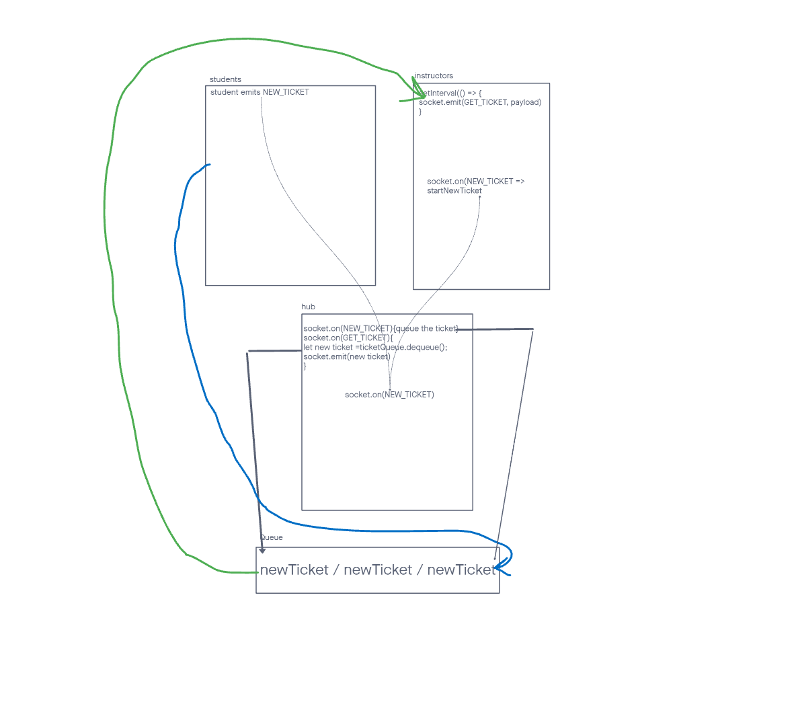

# LAB - Class 14

## Help Ticket Queue

### Author: Elias Staehle and Kenny Lino

### Problem Domain

using socket and queue functionality we are creating a help ticket queue for 4 different classes to submit help tickets for instructors to help the individual students.

### Links and Resources

- [ci/cd](https://github.com/EDStaehle/auth-api/actions) (GitHub Actions)

### Setup

#### `.env` requirements (where applicable)

see `.env.sample`

- `PORT` - Port Number

#### How to initialize/run your application (where applicable)

- `node file name`

#### Features / Routes

- /help = namespaces to connect to.
allows students to input help tickets
enqueues all tickets while instructors are busy helping a student.
teachers will pull a new ticket after they complete the last one.
teachers pull tickets until queue is empty.

#### User Stories

- As a student i would like to be able to submit a help ticket from my class number
- As an instructor I would like to be able to get a new ticket from the ticket queue
- As an instructor I would like to have all tickets stored in a queue while I am busy helping another student

#### Tests

- npm test
- tests that a ticket can be created
- tests that a teacher can get a new ticket
- tests that a ticket will be enqueued
- tests that when teacher is completete they will get the next ticket.
- tests that the queue length reduces or increases based on enqueues or dequeues

#### UML

